<div align="center">

<!-- Header Animé Cyberpunk -->
<svg width="100%" height="200" xmlns="http://www.w3.org/2000/svg">
  <defs>
    <linearGradient id="neonGlow" x1="0%" y1="0%" x2="100%" y2="0%">
      <stop offset="0%" style="stop-color:#ff0080;stop-opacity:1" />
      <stop offset="25%" style="stop-color:#ff8c00;stop-opacity:1" />
      <stop offset="50%" style="stop-color:#40e0d0;stop-opacity:1" />
      <stop offset="75%" style="stop-color:#ff0080;stop-opacity:1" />
      <stop offset="100%" style="stop-color:#40e0d0;stop-opacity:1" />
      <animateTransform attributeName="gradientTransform" type="translate" 
        values="-100,0;100,0;-100,0" dur="3s" repeatCount="indefinite"/>
    </linearGradient>
    
    <filter id="textGlow">
      <feMorphology operator="dilate" radius="2"/>
      <feGaussianBlur stdDeviation="3" result="coloredBlur"/>
      <feMerge>
        <feMergeNode in="coloredBlur"/>
        <feMergeNode in="SourceGraphic"/>
      </feMerge>
    </filter>
  </defs>
  
  <foreignObject width="100%" height="200">
    <div xmlns="http://www.w3.org/1999/xhtml" style="
      display: flex;
      flex-direction: column;
      align-items: center;
      justify-content: center;
      height: 200px;
      background: linear-gradient(45deg, #0a0a0a, #1a1a2e, #16213e);
      font-family: 'Courier New', monospace;
      position: relative;
      overflow: hidden;
    ">
      
      <!-- Particules de fond -->
      <div style="
        position: absolute;
        width: 100%;
        height: 100%;
        background-image: 
          radial-gradient(2px 2px at 20px 30px, #40e0d0, transparent),
          radial-gradient(2px 2px at 40px 70px, #ff0080, transparent),
          radial-gradient(1px 1px at 90px 40px, #ff8c00, transparent);
        animation: sparkle 4s linear infinite;
      "></div>
      
      <style>
        @keyframes sparkle {
          0%, 100% { transform: translate(0, 0); }
          25% { transform: translate(-5px, -5px); }
          50% { transform: translate(5px, -10px); }
          75% { transform: translate(-5px, 5px); }
        }
        @keyframes glitch {
          0%, 100% { transform: translate(0); }
          20% { transform: translate(-2px, 2px); }
          40% { transform: translate(-2px, -2px); }
          60% { transform: translate(2px, 2px); }
          80% { transform: translate(2px, -2px); }
        }
        @keyframes neonFlicker {
          0%, 100% { text-shadow: 0 0 5px #40e0d0, 0 0 10px #40e0d0, 0 0 15px #40e0d0; }
          50% { text-shadow: 0 0 2px #ff0080, 0 0 5px #ff0080, 0 0 8px #ff0080; }
        }
      </style>
      
      <h1 style="
        font-size: 3.5em;
        font-weight: bold;
        margin: 0;
        color: #ffffff;
        text-shadow: 0 0 10px #40e0d0, 0 0 20px #40e0d0, 0 0 30px #40e0d0;
        animation: neonFlicker 2s infinite alternate, glitch 0.3s infinite;
        letter-spacing: 3px;
      ">DON'T PANIC LABS</h1>
      
      <div style="
        font-size: 1.3em;
        color: #ff8c00;
        margin-top: 10px;
        text-shadow: 0 0 5px #ff8c00;
        animation: neonFlicker 3s infinite alternate;
      ">🚀 Le Labo Tech Qui Fait Trembler les Géants 🚀</div>
    </div>
  </foreignObject>
</svg>

<!-- ASCII Art Logo -->
```
██████╗  ██████╗ ███╗   ██╗██╗████████╗    ██████╗  █████╗ ███╗   ██╗██╗ ██████╗
██╔══██╗██╔═══██╗████╗  ██║╚═╝╚══██╔══╝    ██╔══██╗██╔══██╗████╗  ██║██║██╔════╝
██║  ██║██║   ██║██╔██╗ ██║██║   ██║       ██████╔╝███████║██╔██╗ ██║██║██║     
██║  ██║██║   ██║██║╚██╗██║██║   ██║       ██╔═══╝ ██╔══██║██║╚██╗██║██║██║     
██████╔╝╚██████╔╝██║ ╚████║██║   ██║       ██║     ██║  ██║██║ ╚████║██║╚██████╗
╚═════╝  ╚═════╝ ╚═╝  ╚═══╝╚═╝   ╚═╝       ╚═╝     ╚═╝  ╚═╝╚═╝  ╚═══╝╚═╝ ╚═════╝
                                                                                 
             ██╗      █████╗ ██████╗ ███████╗                                   
             ██║     ██╔══██╗██╔══██╗██╔════╝                                   
             ██║     ███████║██████╔╝███████╗                                   
             ██║     ██╔══██║██╔══██╗╚════██║                                   
             ███████╗██║  ██║██████╔╝███████║                                   
             ╚══════╝╚═╝  ╚═╝╚═════╝ ╚══════╝                                   
```

<!-- Badges Dynamiques Ultra Stylés -->
<div style="margin: 30px 0;">
  
  
  
  
  
</div>

<!-- Compteurs Animés -->
<svg width="100%" height="120" xmlns="http://www.w3.org/2000/svg">
  <foreignObject width="100%" height="120">
    <div xmlns="http://www.w3.org/1999/xhtml" style="
      display: flex;
      justify-content: space-around;
      align-items: center;
      height: 120px;
      background: linear-gradient(135deg, #667eea 0%, #764ba2 100%);
      border-radius: 15px;
      padding: 20px;
      font-family: 'Courier New', monospace;
    ">
      <div style="text-align: center; color: white;">
        <div style="font-size: 2.5em; font-weight: bold; text-shadow: 0 0 10px rgba(255,255,255,0.8);">300+</div>
        <div style="font-size: 0.9em; opacity: 0.9;">Clients Conquis</div>
      </div>
      <div style="text-align: center; color: white;">
        <div style="font-size: 2.5em; font-weight: bold; text-shadow: 0 0 10px rgba(255,255,255,0.8);">400%</div>
        <div style="font-size: 0.9em; opacity: 0.9;">ROI Moyen</div>
      </div>
      <div style="text-align: center; color: white;">
        <div style="font-size: 2.5em; font-weight: bold; text-shadow: 0 0 10px rgba(255,255,255,0.8);">48h</div>
        <div style="font-size: 0.9em; opacity: 0.9;">Délai Express</div>
      </div>
      <div style="text-align: center; color: white;">
        <div style="font-size: 2.5em; font-weight: bold; text-shadow: 0 0 10px rgba(255,255,255,0.8);">99%</div>
        <div style="font-size: 0.9em; opacity: 0.9;">Satisfaction</div>
      </div>
    </div>
  </foreignObject>
</svg>

<!-- Status En Direct -->
<div>
  
  
  
</div>

</div>

---

## 🎯 Qui Sommes-Nous ? (Version No Bullshit)

> **"Les consultants facturent des PowerPoints. Nous, on livre du code qui tourne."**

**Don't Panic Labs** = 3 rebels tech de l'École 42 qui ont dit **FUCK aux géants** et prouvent qu'on peut faire de la tech premium sans arnaquer.

**Notre Truc** : Mélanger **IA**, **dev web**, **drones FPV**, **streaming live** et **formation** dans un cocktail tech qui défonce la concurrence.

<div align="center">

### 🔥 NOTRE MISSION 🔥
```diff
+ Démocratiser la tech de pointe. Point.
- Pas de jargon
- Pas de bullshit  
- Pas d'arnaque
+ Juste des résultats qui claquent
```

</div>

---

## 🚀 Nos 6 Super-Pouvoirs

<div align="center">

| 🤖 **IA/ML** | 💻 **Web** | 🎥 **FPV** | 📡 **Stream** | 📚 **Formation** | 🚁 **Drones** |
|:---:|:---:|:---:|:---:|:---:|:---:|
|  |  |  |  |  |  |
| **+280%** productivité | **+320%** conversions | **+450%** engagement | **99.9%** fiabilité | **97%** satisfaction | **99%** réussite |

</div>

---

## 💥 Pourquoi On Écrase La Concurrence

<svg width="100%" height="300" xmlns="http://www.w3.org/2000/svg">
  <foreignObject width="100%" height="300">
    <div xmlns="http://www.w3.org/1999/xhtml" style="
      height: 300px;
      background: linear-gradient(45deg, #f093fb 0%, #f5576c 100%);
      border-radius: 20px;
      padding: 30px;
      color: white;
      font-family: 'Arial', sans-serif;
    ">
      <h2 style="margin: 0 0 20px 0; text-align: center; font-size: 1.8em;">⚡ COMPARAISON EXPLOSIVE ⚡</h2>
      
      <div style="display: grid; grid-template-columns: 1fr 1fr 1fr; gap: 20px; height: 200px;">
        <div style="text-align: center; background: rgba(255,255,255,0.1); border-radius: 15px; padding: 15px;">
          <div style="font-size: 2em; margin-bottom: 5px;">🏢</div>
          <div style="font-size: 1.4em; font-weight: bold;">Clients</div>
          <div style="font-size: 2.2em; font-weight: bold; color: #00ff7f;">300+</div>
          <div style="font-size: 0.9em;">VS Marché: 😴</div>
        </div>
        
        <div style="text-align: center; background: rgba(255,255,255,0.1); border-radius: 15px; padding: 15px;">
          <div style="font-size: 2em; margin-bottom: 5px;">💰</div>
          <div style="font-size: 1.4em; font-weight: bold;">ROI</div>
          <div style="font-size: 2.2em; font-weight: bold; color: #ff6b35;">400%</div>
          <div style="font-size: 0.9em;">VS Marché: +250%</div>
        </div>
        
        <div style="text-align: center; background: rgba(255,255,255,0.1); border-radius: 15px; padding: 15px;">
          <div style="font-size: 2em; margin-bottom: 5px;">⚡</div>
          <div style="font-size: 1.4em; font-weight: bold;">Délai</div>
          <div style="font-size: 2.2em; font-weight: bold; color: #00bfff;">48h</div>
          <div style="font-size: 0.9em;">VS Marché: -80%</div>
        </div>
      </div>
    </div>
  </foreignObject>
</svg>

<div align="center">

### 🎯 Notre Approche "Zero Bullshit"

```diff
❌ EUX                           ✅ NOUS
━━━━━━━━━━━━━━━━━━━━━━━━━━━━━━━━━━━━━━━━━━━━━━━━━━━
- Pitch deck 40 pages          + Devis 2 pages max
- Jargon incompréhensible      + Explications grand-mère
- "On verra bien"              + ROI garanti
- Support email 72h            + WhatsApp 2h max
- Prix caché                   + Tarifs transparents
- Promesses vides              + Résultats mesurables
```

</div>

---

## 🛠️ Process "Fast & Furious" en 4 Étapes

<div align="center">



</div>

```mermaid
graph LR
    A[☕ CAFÉ<br/>30min] --> B[📋 DEVIS<br/>24h] --> C[🚀 BUILD<br/>Updates live] --> D[📊 MESURE<br/>ROI tracké]
    
    style A fill:#ff6b6b,stroke:#333,stroke-width:3px,color:#fff
    style B fill:#4ecdc4,stroke:#333,stroke-width:3px,color:#fff  
    style C fill:#45b7d1,stroke:#333,stroke-width:3px,color:#fff
    style D fill:#f9ca24,stroke:#333,stroke-width:3px,color:#000
```

**1. ☕ ON DISCUTE** → Questions pertinentes, pas de pitch commercial  
**2. 📋 DEVIS 24H** → 2 pages, prix final, zéro surprise  
**3. 🚀 ON BUILD** → Updates WhatsApp quotidiens, démos hebdo  
**4. 📊 ON MESURE** → Dashboard inclus, ajustements gratuits 1er mois  

---

## 👥 L'Équipe (Les 3 Rebelles)

<div align="center">

<svg width="100%" height="250" xmlns="http://www.w3.org/2000/svg">
  <foreignObject width="100%" height="250">
    <div xmlns="http://www.w3.org/1999/xhtml" style="
      display: flex;
      justify-content: center;
      gap: 30px;
      height: 250px;
      align-items: center;
      background: linear-gradient(135deg, #667eea 0%, #764ba2 100%);
      border-radius: 20px;
      padding: 20px;
    ">
      
      <!-- Le Maker -->
      <div style="
        text-align: center;
        color: white;
        background: rgba(255,255,255,0.1);
        padding: 20px;
        border-radius: 15px;
        border: 2px solid #40e0d0;
        width: 200px;
      ">
        <div style="font-size: 3em; margin-bottom: 10px;">🔧</div>
        <div style="font-size: 1.3em; font-weight: bold; margin-bottom: 5px;">LE MAKER</div>
        <div style="font-size: 0.9em; margin-bottom: 10px;">Architecte Technique</div>
        <div style="font-size: 0.8em; opacity: 0.9;">Obsédé par la performance</div>
        <div style="margin-top: 10px;">
          <div style="font-size: 0.8em;">💻 Full-Stack God</div>
          <div style="font-size: 0.8em;">⚡ Speed Demon</div>
        </div>
      </div>
      
      <!-- Le Créatif -->
      <div style="
        text-align: center;
        color: white;
        background: rgba(255,255,255,0.1);
        padding: 20px;
        border-radius: 15px;
        border: 2px solid #ff0080;
        width: 200px;
      ">
        <div style="font-size: 3em; margin-bottom: 10px;">🎨</div>
        <div style="font-size: 1.3em; font-weight: bold; margin-bottom: 5px;">LE CRÉATIF</div>
        <div style="font-size: 0.9em; margin-bottom: 10px;">Directeur Artistique</div>
        <div style="font-size: 0.8em; opacity: 0.9;">Pixel-perfectionniste</div>
        <div style="margin-top: 10px;">
          <div style="font-size: 0.8em;">🎥 FPV Master</div>
          <div style="font-size: 0.8em;">✨ UI/UX Wizard</div>
        </div>
      </div>
      
      <!-- Le Stratège -->
      <div style="
        text-align: center;
        color: white;
        background: rgba(255,255,255,0.1);
        padding: 20px;
        border-radius: 15px;
        border: 2px solid #ff8c00;
        width: 200px;
      ">
        <div style="font-size: 3em; margin-bottom: 10px;">📊</div>
        <div style="font-size: 1.3em; font-weight: bold; margin-bottom: 5px;">LE STRATÈGE</div>
        <div style="font-size: 0.9em; margin-bottom: 10px;">Growth Hacker</div>
        <div style="font-size: 0.8em; opacity: 0.9;">Anti-bullshit expert</div>
        <div style="margin-top: 10px;">
          <div style="font-size: 0.8em;">📈 ROI Hunter</div>
          <div style="font-size: 0.8em;">🎯 Results Focused</div>
        </div>
      </div>
      
    </div>
  </foreignObject>
</svg>

**🔥 Notre Philosophie :** *"Les géants paniquent. Pas nous."*

</div>

---

## 💬 Ce Que Disent Nos Clients (Sans Filter)

<div align="center">

<table>
<tr>
<td width="50%">

> **"Avant DontPanicLabs, on payait 8K/mois pour une IA qui comprenait rien. Maintenant, notre bot gère 80% du support client et nos clients sont plus contents. Do the math."**
> 
> — **Marc Dupont**, CEO TechnoPlus SA
> 
> ⭐⭐⭐⭐⭐ **ROI: +380%**

</td>
<td width="50%">

> **"3 agences, 5 freelances, 0 résultat. DPL a tout refait en 3 semaines. Site moderne, IA intégrée, formation équipe. Ma concurrence pleure."**
> 
> — **Sophie Martin**, Directrice Boutique Léman
> 
> ⭐⭐⭐⭐⭐ **Délai tenu: 21 jours**

</td>
</tr>
</table>

</div>

---

## 🎁 OFFRE SPÉCIALE 2025 (Limitée!)

<div align="center">

<svg width="100%" height="180" xmlns="http://www.w3.org/2000/svg">
  <foreignObject width="100%" height="180">
    <div xmlns="http://www.w3.org/1999/xhtml" style="
      height: 180px;
      background: linear-gradient(45deg, #ff9a9e 0%, #fecfef 50%, #fecfef 100%);
      border-radius: 20px;
      display: flex;
      align-items: center;
      justify-content: center;
      padding: 30px;
      border: 3px dashed #ff0080;
      position: relative;
      overflow: hidden;
    ">
      
      <div style="position: absolute; top: 10px; right: 20px; background: #ff0080; color: white; padding: 5px 15px; border-radius: 20px; font-weight: bold; animation: pulse 2s infinite;">
        🔥 LIMITED TIME 🔥
      </div>
      
      <div style="text-align: center; color: #333;">
        <h2 style="margin: 0 0 15px 0; font-size: 2.2em; color: #ff0080;">-40% AUDIT TECH COMPLET</h2>
        <div style="font-size: 1.3em; margin-bottom: 10px;"><s>2000 CHF</s> → <strong style="color: #ff0080;">1200 CHF</strong></div>
        <div style="font-size: 1em;">✅ Analyse stack actuel ✅ Quick wins ✅ Roadmap perso ✅ ROI détaillé</div>
      </div>
      
      <style>
        @keyframes pulse {
          0% { transform: scale(1); }
          50% { transform: scale(1.1); }
          100% { transform: scale(1); }
        }
      </style>
    </div>
  </foreignObject>
</svg>

</div>

---

## 🚀 CONTACT EXPRESS (No Bullshit Zone)

<div align="center">

### 📱 VOIES RAPIDES

[](https://wa.me/41791234567)
[](mailto:hello@dontpaniclabs.com)
[](https://calendly.com/dontpaniclabs)

### 📍 INFOS PRATIQUES

```
🏢 Adresse     : 42 Rue de l'Innovation, 1201 Genève  
📧 Email       : hello@dontpaniclabs.com
💬 WhatsApp    : +41 79 XXX XX XX (Réponse < 2h)
🌐 Site        : dontpaniclabs.com
🕐 Dispo       : Lun-Ven 8h-19h, Sam 10h-16h
```

### 🗺️ ZONE D'INTERVENTION

**Suisse Romande + 100km** : Genève • Lausanne • Neuchâtel • Fribourg • Sion • Berne • Annecy (FR)

</div>

---

## 🔗 LIENS UTILES

<div align="center">

| 🌐 **Site Web** | 📚 **Docs** | 🎥 **Portfolio FPV** | 📝 **Blog** | 💼 **LinkedIn** | 🐙 **GitHub** |
|:---:|:---:|:---:|:---:|:---:|:---:|
| [dontpaniclabs.com](https://dontpaniclabs.com) | [docs.dontpaniclabs.com](https://docs.dontpaniclabs.com) | [portfolio](https://dontpaniclabs.com/portfolio) | [blog.dontpaniclabs.com](https://blog.dontpaniclabs.com) | [LinkedIn](https://linkedin.com/company/dontpaniclabs) | [GitHub](https://github.com/dontpaniclabs) |

</div>

---

<div align="center">

<!-- Footer Animé -->
<svg width="100%" height="100" xmlns="http://www.w3.org/2000/svg">
  <foreignObject width="100%" height="100">
    <div xmlns="http://www.w3.org/1999/xhtml" style="
      height: 100px;
      background: linear-gradient(90deg, #000000, #434343);
      display: flex;
      flex-direction: column;
      align-items: center;
      justify-content: center;
      color: white;
      font-family: 'Courier New', monospace;
      position: relative;
    ">
      
      <div style="
        font-size: 1.5em;
        font-weight: bold;
        margin-bottom: 5px;
        color: #40e0d0;
        text-shadow: 0 0 10px #40e0d0;
      ">🇨🇭 Fabriqué en Suisse avec Passion 🇨🇭</div>
      
      <div style="
        font-size: 1.2em;
        color: #ff8c00;
        font-style: italic;
        text-shadow: 0 0 5px #ff8c00;
      ">"Les géants paniquent. Pas nous."</div>
      
      <div style="
        position: absolute;
        bottom: 5px;
        right: 10px;
        font-size: 0.8em;
        opacity: 0.7;
      ">v2025.1 • Made with 💖 & ☕</div>
    </div>
  </foreignObject>
</svg>

**⚡ PRÊT À FAIRE TREMBLER VOS CONCURRENTS ? ⚡**

[](https://wa.me/41791234567)

</div>

<!-- Easter Egg -->
<details>
<summary>🎮 Easter Egg - Pour les vrais geeks</summary>

```
░░░░░░░▄▄▄▄▄▄▄▄▄▄▄▄▄░░░░░░░
░░░░▄█████████████████▄░░░░
░░▄██████████████████████▄░░
░█████████████████████████░░
███████████████████████████░
███████████████████████████░
███████████████████████████░
░█████████████████████████░░
░░▄██████████████████████▄░░
░░░░▄█████████████████▄░░░░
░░░░░░░▀▀▀▀▀▀▀▀▀▀▀▀▀░░░░░░░

"With great code comes great responsibility"
                    - Uncle Ben Parker (si il était dev)

Konami Code: ↑↑↓↓←→←→BA
Unlock: Coffee Mode Activated ☕
```

</details>
